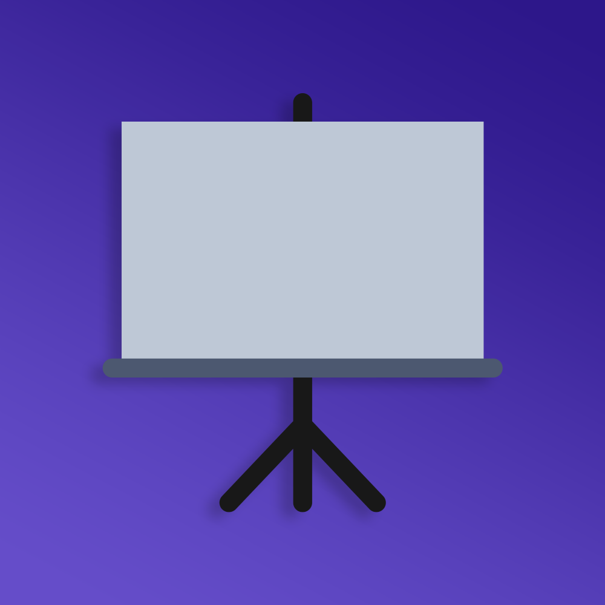
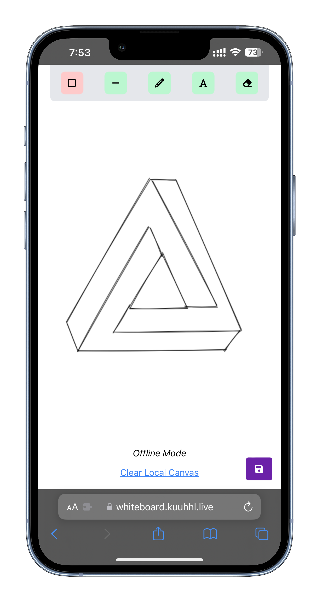
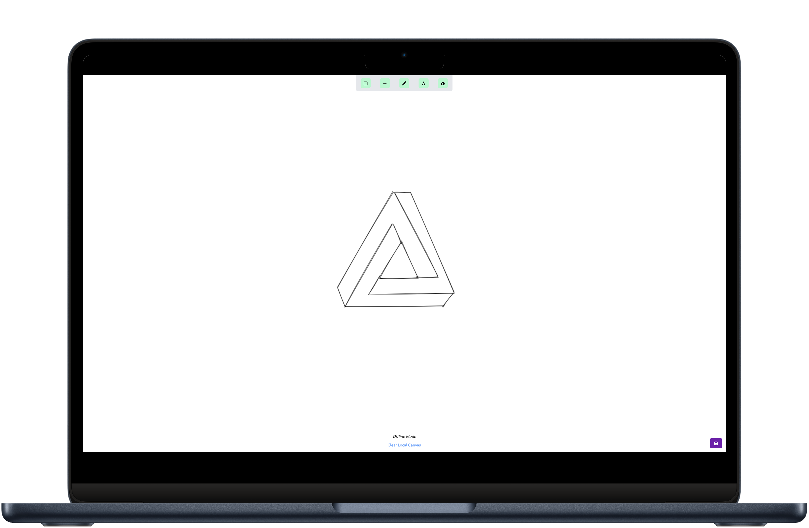

  
  
  
  
  

 

  

  <h3 align="center">Collaborative Whiteboard</h3>
  
A platform for collaborative sketching and brainstorming

  

## Screenshots

  
  

## Features

* Real-time collaborative sketching
* Offline-Mode for local sketching
* User-friendly interface
* Save and export sketches
* Responsive design for various devices
* Pencil, Eraser, Rectangle, Text and Line Tools

## Contributors

