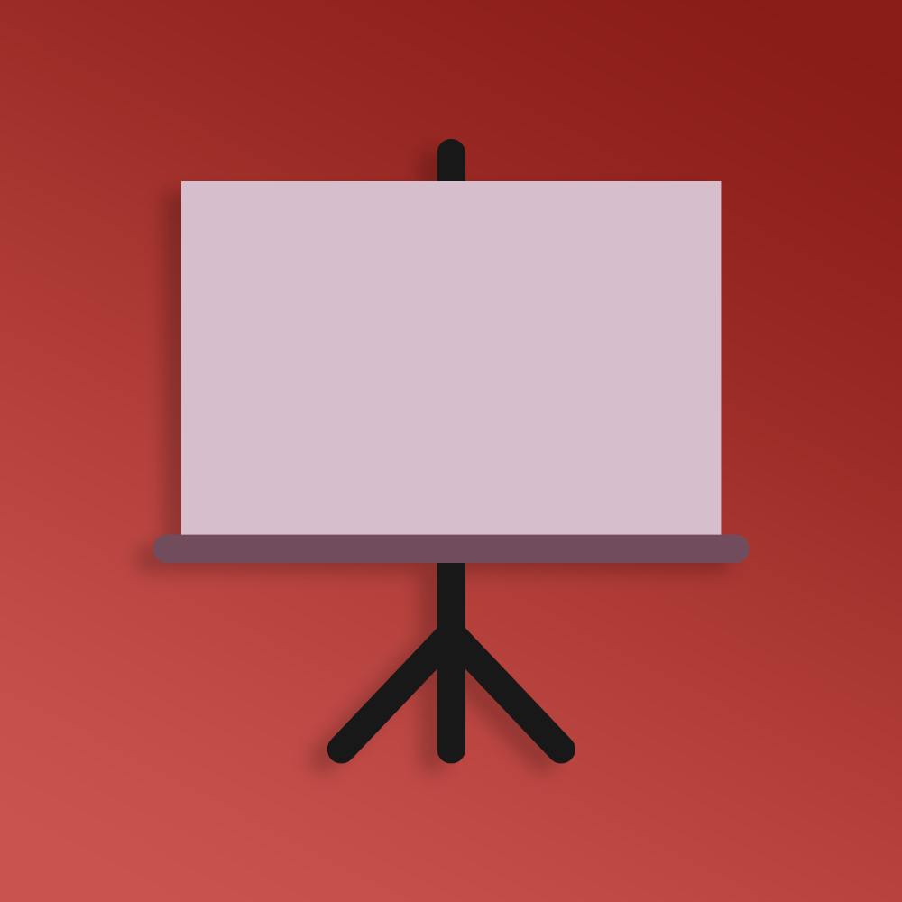

  
  
  
  

 

  
  <h3 align="center">Collaborative Whiteboard - Backend</h3>
  
A platform for collaborative sketching and brainstorming. - Backend

  

## Run locally

1. Clone the repository
2. Install dependencies with `npm install`
3. Start the development server with `npm start`

## Client <-> Server interaction

1. Clients establish bidirectional connection with the server using `socket.io`.
2. After adding / changing any elements in the whiteboard, the client sends the changes to the server.
3. The server updates the state of the whiteboard in the database.
4. The change is broadcasted to all other clients in the room to update their whiteboards.

## Contributors

