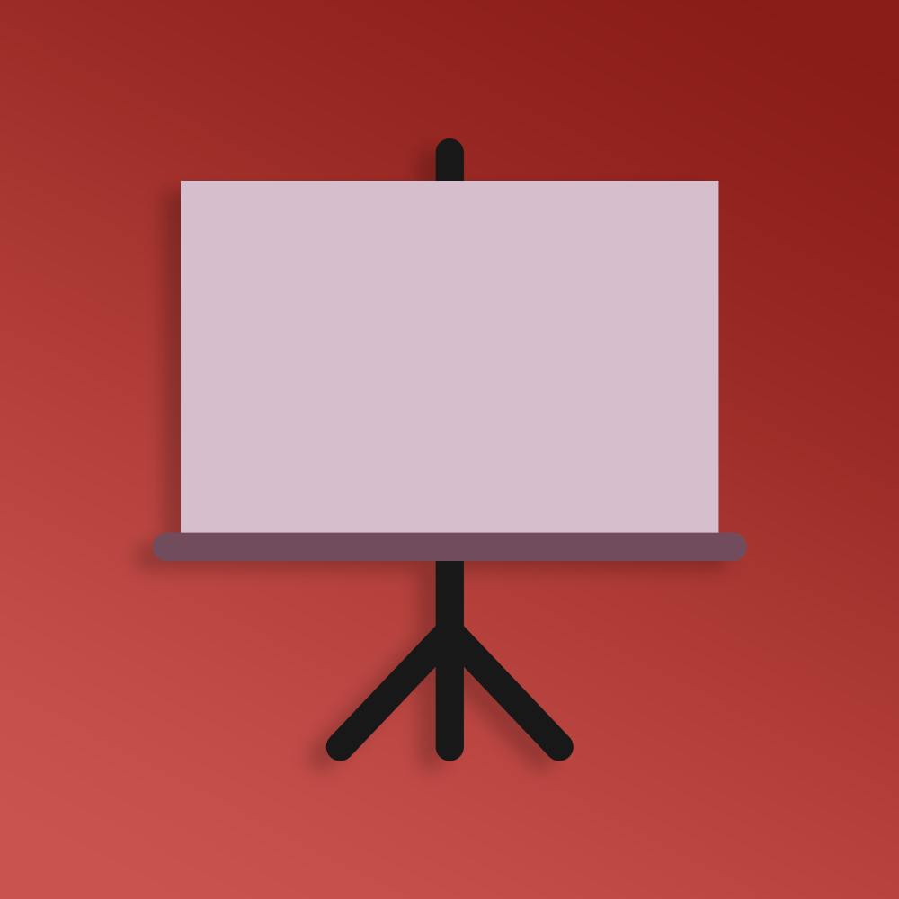

  
  
  
  

 

  
  <h3 align="center">Collaborative Whiteboard - Backend</h3>
  
A platform for collaborative sketching and brainstorming. - Backend

## Run locally

1. Clone the repository
2. Install dependencies with `yarn` / `npm install`
3. Deploy Frontend, MongoDB and Redis Instances and specify the environment variables.
4. Start the development server with `yarn start` / `npm start`

### Environment Variables

* `FRONTEND_BASE_URL`
* `REDIS_HOST`
* `REDIS_PORT`
* `MONGO_DB_URL`
* `MONGO_DB_NAME`

## Client <-> Server interaction

1. Clients establish bidirectional connection with the server using `socket.io`. To support multiple backend instances and maintain a mapping of socket.io connections to Session-IDs, a Redis Socket.io Adapter is used.
2. After adding / changing any elements in the whiteboard, the client sends the changes to the server.
3. The server updates the state of the whiteboard in the MongoDB Database.
4. The change is broadcasted to all other clients in the room to update their whiteboards.