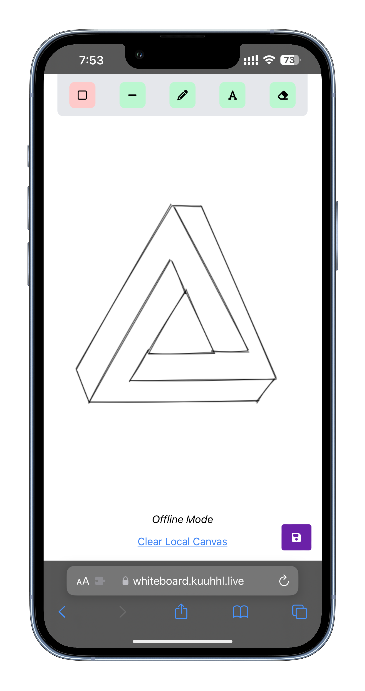
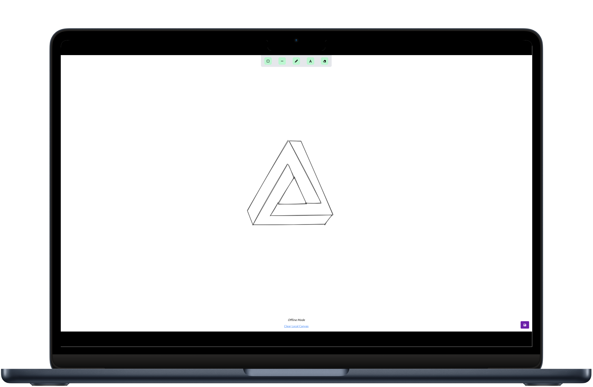

  

  
  
  

 

  

  <h3 align="center">Collaborative Whiteboard - Frontend</h3>
  
A platform for collaborative sketching and brainstorming.

  

## Screenshots

  
  

## Run locally

1. Clone the repository
2. Install dependencies with `yarn` / `npm install`
3. Start the development server with `yarn start` / `npm start`
4. Open [http://localhost:3000](http://localhost:3000) in your browser to see the result.
